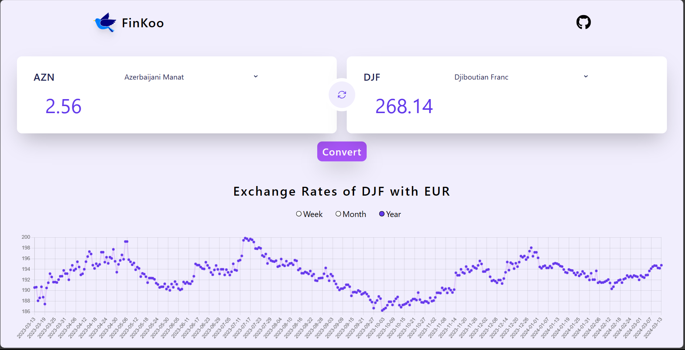

# FinKoo

Online currency converter with exchange rates information.

## Description

FinKoo is a web application that allows users to convert currencies and provides up-to-date exchange rates information. It is built using React, Tailwind CSS, yarn, and chart.js. The project utilizes the **Currency Converter And Exchange Rates API** by Rapid API to convert the currencies and fetch the exchange rates data.

## Installation

1. Clone the repository:

    ```bash
    git clone https://github.com/sakshamjain0464/FinKoo.git
    ```

2. Install the dependencies:

    ```bash
    yarn install
    ```

## Usage

1. Start the development server:

    ```bash
    yarn start
    ```

2. Open your browser and navigate to `http://localhost:5173`.

## API Key

To use the Currency Converter API by Rapid API, you need to obtain an API key. Follow the steps below to get your API key:

1. Sign up for an account on Rapid API (https://rapidapi.com/).

2. Search for the [Currency Converter and Exchange Rates](https://rapidapi.com/principalapis/api/currency-conversion-and-exchange-rates) API and subscribe to it.

3. Copy your API key.

4. Create a `.env` file in the root directory of the project and add the following line:

    ```
    VITE_API_KEY = YOUR_API_KEY
    VITE_API_HOST = YOUR_API_HOST
    ```

    Replace `YOUR_API_KEY` with your actual API key.

## Demo

